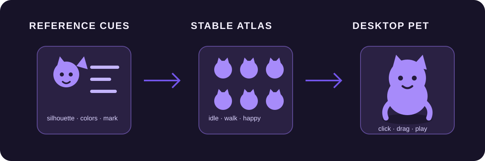

# Codex Skills

> Reusable Codex Skills for making focused, verifiable tools.

[](build-portable-desktop-pet/SKILL.md)
[](build-portable-desktop-pet/SKILL.md)
[](LICENSE)

## From visual references to a portable desktop pet

`build-portable-desktop-pet` turns one or more visual references into **portable single-file Windows desktop pets**. It preserves the character cues that matter, generates a reusable animation atlas, and scaffolds a transparent Win32 application with click and drag interactions.



The illustration is intentionally abstract. This repository does **not** bundle private reference images, generated character art, or a finished EXE.

## What the Skill covers

- Inspects references and writes an `identity-lock.md` before visual generation.
- Keeps silhouette, palette, asymmetric markings, and character-relative directions stable.
- Creates one transparent 8 × 11 sprite atlas for Idle, Walk, Run, Sleep, Think, Happy, and Drag behavior.
- Scaffolds a borderless, always-on-top Win32 pet: click for Happy, double-click for Sleep/Wake, drag to move, right-click for a menu.
- Builds a Windows x64 GUI executable and verifies its PE format, `.rsrc` section, imports, embedded-path safety, and SHA-256.

## Quick Start

1. Clone this repository and place `build-portable-desktop-pet/` in your local Codex Skills directory.
2. In Codex, provide your image references and ask to use `$build-portable-desktop-pet`.
3. The Skill follows this delivery chain:

   ```text
   reference inspection -> identity-lock.md -> atlas + icon -> source project -> EXE + SHA-256
   ```

To scaffold a project manually after preparing a transparent atlas and icon:

```bash
cd build-portable-desktop-pet
scripts/scaffold_pet.py --name NAME --atlas ATLAS.png --icon ICON.png --output-dir PROJECT
```

## Workflow

1. Inspect every reference and lock the visual identity in `identity-lock.md`.
2. Generate a character-consistent transparent atlas and application icon.
3. Run `scripts/scaffold_pet.py` to create the portable pet source project.
4. Test the generated Go runtime and run its Windows build script.
5. Verify the output EXE and deliver its SHA-256 alongside concise usage instructions.

## Requirements

- Codex with this Skill available.
- A Darwin or Linux build host.
- Python 3 with Pillow for atlas and icon processing.
- Windows 10/11 x64 for the finished application.

The runtime is designed for silent, offline, no-install, no-admin, and no-autostart use.

## Outputs

Each completed pet includes:

- `identity-lock.md` with fixed visual cues and directional markings.
- A transparent 8 × 11 animation atlas and an app icon.
- A scaffolded Go/Win32 source project.
- One portable Windows x64 EXE.
- A short usage note and SHA-256 digest.

## Verification

Run the Skill's self-test from its directory:

```bash
cd build-portable-desktop-pet
scripts/self-test.sh
```

Verify a completed build with its EXE path and absolute generated project root:

```bash
build-portable-desktop-pet/scripts/verify-delivery.sh PROJECT/outputs/Pet.exe "$(cd PROJECT && pwd -P)"
```

The verifier checks static packaging evidence only. Real-machine validation on Windows 10/11 remains separate: confirm the transparent window, click, drag, sleep/wake, menu, and animation behavior on an actual Windows device.

## Repository structure

```text
build-portable-desktop-pet/
├── SKILL.md                         # compact operating contract
├── scripts/                         # scaffold, self-test, and delivery verifier
└── assets/windows-go-template/      # character-neutral Win32 runtime template
assets/readme/reference-to-pet.svg   # safe, abstract workflow illustration
```

## 中文快速开始

这是一个把参考图转为 **Windows 10/11 x64 单文件桌宠** 的 Codex Skill。将 `build-portable-desktop-pet` 放入本地 Codex Skills 目录后，在对话中提供参考图并调用 `$build-portable-desktop-pet`。它会先固化角色特征，再生成图集、脚手架工程和 EXE，并输出 SHA-256。

请勿把私密照片、未授权角色素材或已完成的 EXE 提交到这个公开仓库；这里只保存可复用的 Skill、模板和安全示例图。

## Contributing

Issues and pull requests are welcome. Keep contributions character-neutral, avoid private or third-party visual assets, and run the relevant self-tests before opening a pull request.

## License

This repository is available under the [MIT License](LICENSE).
